<h1 align="center">  Hi 👋, I am Teodie </h1> 

  

A Computer Engineer with passion on solving real world problems with help the of Software and Electronics

- 🔭 I’m currently working on Web and Mobile application.
- 🌱 I’m currently learning as a freelancer to sell and get clients.
- 💬 Ask me about React Native, Nextjs and System design
- ⚡ Fun fact: Inches is based on centimeter to become standard.

### 🛠️ Languages and Tool

                     
